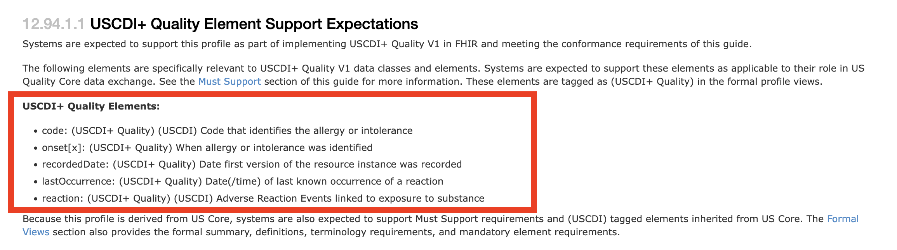
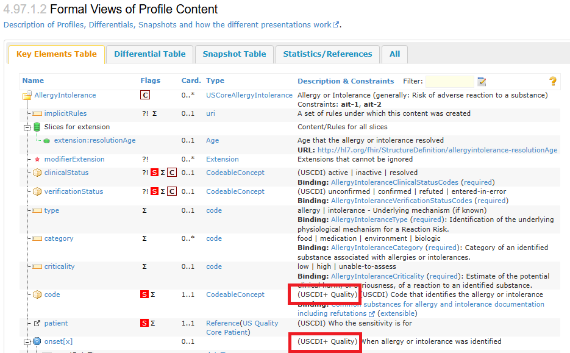

# Must Support - 2026 US Quality Core Implementation Guide v0.5.0

## Must Support

US Quality Core derives from US Core, and therefore the [requirements on "MustSupport" defined in US Core](http://hl7.org/fhir/us/core/STU6.1/must-support.html) must be respected.

US Quality Core adopts the QI-Core approach to flag USCDI+ Quality elements with a [US Quality Core USCDI+ Quality Extension](StructureDefinition-uscdiplusquality.md) to indicate significance for implementers, instead of applying additional "MustSupport" flags above the inherited US Core "MustSupport" flags. This is consistent with US Core's use of the [USCDI Requirement Extension](https://hl7.org/fhir/us/core/STU6.1/StructureDefinition-uscdi-requirement.html) to indicate those requirements specifically applicable to USCDI conformance.

Implementers are expected to implement all profiles and FHIR elements that contain the USCDI+ Quality flag, shown as (USCDI+ Quality).

Each of the US Quality Core profiles that are in scope for the conformance requirements of this guide includes a summary of the elements flagged as USCDI+ Quality elements. This summary is presented in the Examples section, located above the Formal View of Profile Content. See Figure 1 as an example.

**Figure 1. Summary of USCDI+ Quality Elements in a US Quality Core Profile**

Figure 2 below illustrates how the USCDI+ Quality flag is presented in Formal View of Profile Content, the "Key Elements Table" tab, on the US Quality Core profile pages.

**Figure 2. USCDI+ Quality Flag in Formal View of Profile Content**

